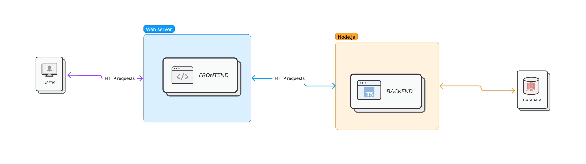
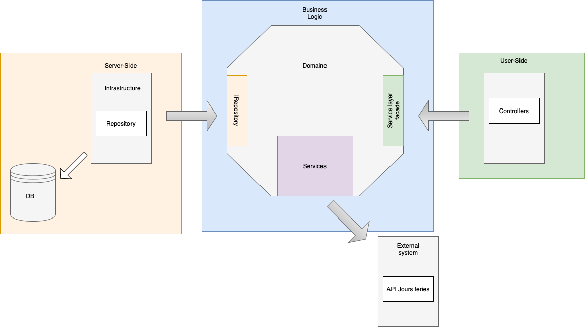

Cette section offre un aperçu détaillé de l'architecture globale du projet, ainsi que de la structure spécifique du backend. Cette section vise à explorer les choix effectués concernant l'architecture de l'application de gestion des comptes rendus d'activités (CRA). En examinant la disposition globale de l'architecture et en plongeant dans les composants clés du backend, nous obtiendrons une vision complète des mécanismes qui sous-tendent cette solution.

## Architecture globale 
Pour l'architecture globale, on a opté pour une architecture client-serveur. Cette architecture permet une séparation nette entre le client (l'interface utilisateur) et le serveur, qui abrite la logique fondamentale de l'application ainsi que le stockage des données. Cette approche a été privilégiée pour sa capacité à favoriser la scalabilité, la maintenabilité et la sécurité de l'ensemble du système.

- Serveur Web(Frontend) : Le serveur web est chargé d'héberger la composante frontend de l'application. C'est la première étape du processus de communication, où les requêtes émanant des utilisateurs sont capturées et transmises au serveur Node.js pour être traitées. Cette première interaction garantit une expérience utilisateur fluide et réactive.
- Serveur NodeJS : Le serveur Node.js héberge la partie backend de l'application, qui gère la logique métier, les traitements de données et les interactions avec la base de données.
- Base de données :  Le serveur Node.js interagit avec la base de données pour stocker et récupérer les informations nécessaires. Cette composante joue un rôle crucial dans la persistance des données, assurant ainsi l'intégrité et la disponibilité des données tout au long du cycle de vie de l'application.

En résumé, notre architecture globale repose sur une approche client-serveur qui optimise la gestion des données et la réactivité de l'interface utilisateur. Cette conception modulaire et bien définie facilite le développement, la maintenance et l'évolutivité de l'application, tout en répondant aux exigences de sécurité et de performances.

## Architecture du back-end
Dans cette section on presente les principes fondamentaux qui ont guidé la conception de cette couche cruciale de l'application.
Pour concevoir et structurer la couche backend de l'application , on a adopté l’architecture hexagonale.
Cette approche modulaire favorise une séparation claire des préoccupations et facilite la gestion de la complexité, tout en permettant un faible couplage des composants , une forte cohérence et une maintenance optimale.
L'architecture hexagonale, également appelée architecture en ports et adaptateurs, repose sur le concept de "ports" et "adaptateurs" qui représentent les points d'entrée et de sortie de l'application. Cette approche permet de mieux gérer les dépendances et les interactions avec les composants externes, contribuant ainsi à une meilleure modularité et à une flexibilité accrue.

- Domaine : représente le cœur de l'architecture hexagonale. Il encapsule les entités, les règles métier et les services.

- Couche Applicative (user-side) : Cette couche contient les cas d'utilisation spécifiques de l'application. Une façade (craApplication) orchestre les interactions entre le domaine et cette couche en implémentant les cas d'utilisation métier.Cette couche sert de pont entre le backend et le domaine extérieur, y compris l'interface utilisateur et les services externes.

- Couche Infrastructure : Cette couche contient les composants techniques, tels que les implémentations concrètes des méthodes et l'accès à la base de données.

