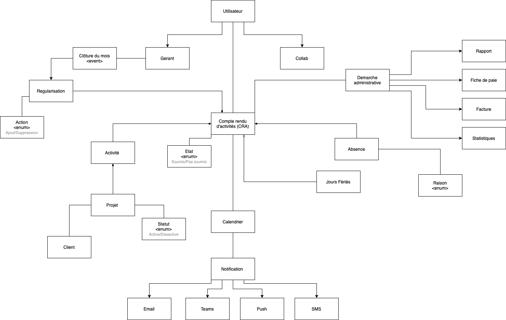

# Domaine de l'Application

Le cœur de l'application et l'architecture hexagonale réside dans le domaine. Comprendre les concepts et les relations entre ces entités est essentiel pour avoir une vue complète du fonctionnement de l'application.
On a crée un modèle de domaine afin de mieux comprendre et représenter tous les aspects et les relations.
Il a pour but de guider les choix de conception, informer les relations entre les classes et garantir une cohérence entre les différents éléments.

  

## Entités Principales

### Compte Rendu d'Activité (CRA)

Le Compte Rendu d'Activité est l'élément central de l'application. Il représente les activités effectuées par les employés au cours d'une période donnée. Chaque CRA contient des informations détaillées sur les heures travaillées, les absences etc. Ces informations sont essentielles pour évaluer la performance et générer les factures et les fiches de paie.

### Absence

L'entité Absence enregistre les jours où un employé est absent pour des raisons médicales ou autres.
Une raison est associée à une absence et peut être :
- Congés
- Congés sans solde
- Maladie
- RTT
- Formation

### Activité

L'entité Activité est liée aux projets spécifiques sur lesquels les employés travaillent. Elle enregistre les heures consacrées à chaque projet, ce qui est crucial pour évaluer le temps de travail pour les fiches de paie de l'employé et les factures des cleints.

### Collaborateur (Collab)

L'entité Collaborateur représente les employés de l'entreprise. Chaque CRA est associé à un Collaborateur, ce qui permet de suivre les activités individuelles et d'analyser les performances ainsi que garder une historique des activités.

### Gérant

Le Gérant est responsable de la suivie des CRA et de la génération des factures et des fiches de paie. Il a accès à l'ensemble des données pour superviser et même modifier les données.

### Projet

L'entité Projet représente les projets sur lesquels l'entreprise travaille. Chaque activité est associée à un Projet, ce qui permet de regrouper les heures de travail par projet.
Le gérant est le responsable de la gestion de tous les projets , y compris l'affection des collaborateur aux projets.

### Jours fériés
Les jours fériés sont associés au CRA.Ils sont automatiquement récupérés à l'aide d'un API externe, voir plus ici https://api.gouv.fr/les-api/jours-feries

### Clôture du Mois

L'événement "Clôture du Mois" marque la fin d'une période de travail. Il déclenche la création de l'entité Regularisation apres chaque modification de CRA, qui permet de réajuster les heures de travail en fonction des jours ouvrés et jours fériés.

## Relations et Interactions

Les entités du domaine interagissent de manière étroite pour créer un processus fluide. Par exemple, un CRA enregistré est utilisé pour générer les factures et les fiches de paie associées à ce mois. 

Cette compréhension approfondie du domaine et de ses interactions est essentielle pour développer des fonctionnalités précises et répondre aux besoins des utilisateurs de manière efficace.

