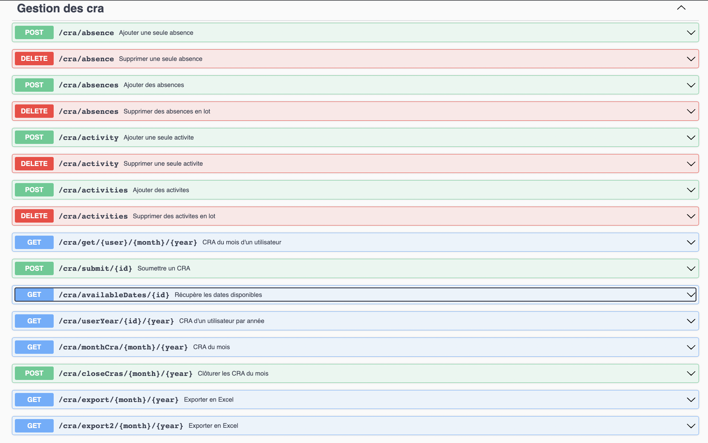
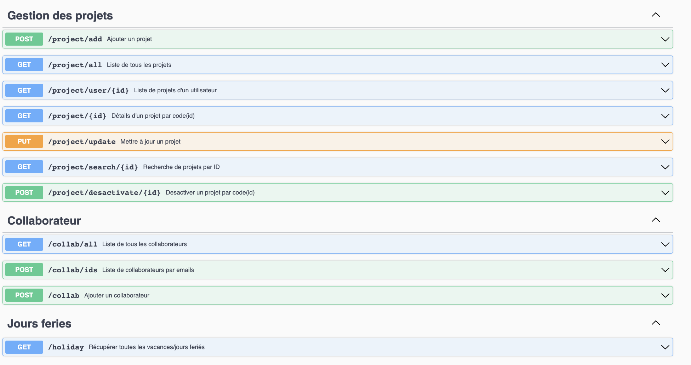

La documentation Swagger a été incorporée dans le projet pour fournir une vue détaillée et conviviale de l'API développée. Elle sert de référence centrale pour comprendre les endpoints, les requêtes acceptées et les réponses renvoyées par l'API.

## Accès à Swagger

L'accès à la documentation Swagger est rendu possible en visitant le chemin `/api` de l'application. 
Une fois que vous aurez visité cette URL, vous serez accueilli par l'interface interactive de Swagger, qui affiche une liste complète des endpoints disponibles, des détails sur les paramètres requis et les réponses associées.

  

 